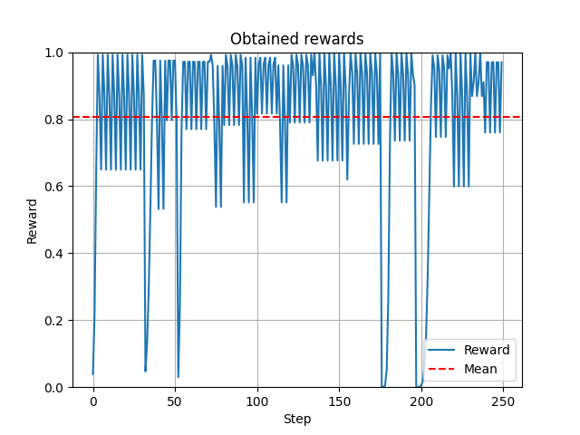

# Play Flappy Bird by applying Dueling Double Deep Q Learning 
## by Alaa Adam, Tobias Kretschel and Tim Niklas Witte 

This repository contains an AI which is able to play Flappy Bird.
The AI is based on Dueling Double Deep Q Learning.
For training the AI a Flappy Bird gym was developed (also contained in this repo).
It supports both a window and a no window mode.


The AI was pretrainied (weights in `./saved_model`) for 810 episodes. 
Besides, `PlayGame.py` enables to see the AI in action (see "Game Window: See results").


## Reward

## Model

### Input 
The artifical neural network receives information about the positions of the 
bird and of the "first column".
Note that, "first column" is the nearest column to the bird.
x0, y0, x1 and y1 are coordinates to describe a rectangle.

```python
bird_pos_x0, bird_pos_y0,
bird_pos_x1, bird_pos_y1,
first_column.top_pos_x0, first_column.top_pos_y0,
first_column.top_pos_x1, first_column.top_pos_y1,
first_column.down_pos_x0, first_column.down_pos_y0,
first_column.down_pos_x1, first_column.down_pos_y1
```

### Neural network structure

```bash
Layer (type)                 Output Shape              Param #   
=================================================================
dense (Dense)                multiple                  1600      
_________________________________________________________________
dense_1 (Dense)              multiple                  8320      
_________________________________________________________________
dense_2 (Dense)              multiple                  129       
_________________________________________________________________
dense_3 (Dense)              multiple                  258       
=================================================================
Total params: 10,307
```

## Evaluation

In order to demonstrate the models performance, it did 250 steps.



Overall, it archived an average reward of about 0.8.
It never occured a collison with a column aka pipe.

## Usage

### Start training

Run `Training.py`.

```bash
python3 Training.py
```

Each 10th episodes the model weights are stored in `./saved_model/trainied_weights_epoch_X`.
X denotes the number of the episode.
Besides, corresponding TensorBoard files are saved in `./test_logs/`

### Game Window: See results  

### Without plots


Run the `PlayGame.py`.

```bash
python3 PlayGame.py
```

### With plots


Run the `PlayGame.py`.

```bash
python3 PlayGame.py
```
