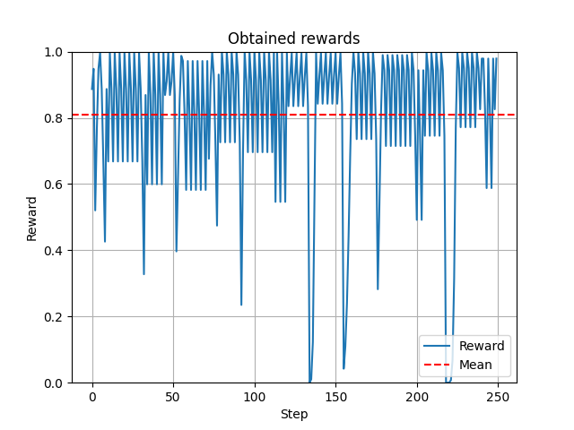

# Play Flappy Bird by applying Dueling Double Deep Q Learning 
## by Alaa Adam, Tobias Kretschel and Tim Niklas Witte 

This repository contains an AI which is able to play Flappy Bird.
The AI is based on Dueling Double Deep Q Learning.
In order to train the AI, a Flappy Bird gym was developed which is also contained in this repository (see `./FlappyBirdGym`).
Its usage will be explained at the end of the README.
It supports both a window and a no window mode.
Besides, the interface of the Flappy Bird gym is similar to the gyms developed by [OpenAI](https://gym.openai.com/).


The AI was pretrainied for 810 episodes.
The weights are saved in `./saved_model`. 
Besides, `PlayGame.py` enables to see the AI in action (see "Game Window: See results").

## Requirements
- TensorFlow 2
- Numpy
- tkinter
- matplotlib
- argparse
- imageio
- pyautogui

## Reward System

The reward is normal distributed where x is `bird_posY0`.
It is normalized to be between 0 and 1 in order to prevent tiny q values.


The two vertical ordered columns which are the nearest to the bird are considered for the reward calculation.
µ denotes the y coordinate of the center of the space between these two columns.
σ denotes the scaled length in y direction of this space.
In order to force the model to control the bird more in the middle of space the length of this space is scaled by a factor of 0.125.


## Model

### Input 
The artifical neural network receives the previous and last game state as its input.
Both game states are concatenated.

```python
[previous_game_state, current_game_state]
```

A game state is described as the coordinates of the bird and the so called "first column"
which is nearest column to the bird.
Both the bird and the column are rectangles.
Note that, in order to represent a rectangle there are four points aka coordinates
necessary: `x0, y0, x1, y1`

```python
bird_pos_x0, bird_pos_y0,
bird_pos_x1, bird_pos_y1,
first_column.top_pos_x0, first_column.top_pos_y0,
first_column.top_pos_x1, first_column.top_pos_y1,
first_column.down_pos_x0, first_column.down_pos_y0,
first_column.down_pos_x1, first_column.down_pos_y1
```

At the beginning, the `previous_game_state` is a zero vector.

### Artificial Neural Network

The model has the following architecture:
```bash
Model: "DDQN"
__________________________________________________________________________________________________
 Layer (type)                   Output Shape         Param #     Connected to                     
==================================================================================================
 [Previous game state, current   [(None, 24)]        0           []                               
 game state] (InputLayer)                                                                         
                                                                                                  
 tanh_0 (Dense)                 (None, 64)           1600        ['[Previous game state, current g
                                                                 ame state][0][0]']               
                                                                                                  
 tanh_1 (Dense)                 (None, 128)          8320        ['tanh_0[0][0]']                 
                                                                                                  
 adventage (Dense)              (None, 2)            258         ['tanh_1[0][0]']                 
                                                                                                  
 tf.math.reduce_mean (TFOpLambd  (None, 1)           0           ['adventage[0][0]']              
 a)                                                                                               
                                                                                                  
 state (Dense)                  (None, 1)            129         ['tanh_1[0][0]']                 
                                                                                                  
 subtract (Subtract)            (None, 2)            0           ['adventage[0][0]',              
                                                                  'tf.math.reduce_mean[0][0]']    
                                                                                                  
 add (Add)                      (None, 2)            0           ['state[0][0]',                  
                                                                  'subtract[0][0]']               
                                                                                                  
==================================================================================================
Total params: 10,307
Trainable params: 10,307
Non-trainable params: 0
__________________________________________________________________________________________________

```


### Hyperparameters

```python3

General:
    learning rate = 0.001
    optimizer = Adam
    loss function = mean squared error
    batch size = 32

EpsilonGreedyStrategy:
    start = 1.0 
    end = 0.05
    decay = 0.99 (multiplicative decay after each episode until end is reached)

ReplayMemory:
    capacity = 500.000
    num_samples = 250.000 # number until training the network starts
    sampling process: samples with higher reward preferred

Deep Q Learning:
    gamma = 0.99
    update = 100 # number of episodes when weights of qnet = weights of target net
```

## Pre-trained model

As mentioned above, the model was trained for 810 episodes.
Episodes for filling the ReplayMemory are not counted in this number of episodes.


## Evaluation

In order to demonstrate the models performance, it performs 250 steps.



Overall, it archived an average reward of about 0.8.
It never occured a collison with a column aka pipe.

## Usage

### Start training

Run `Training.py`.

```bash
python3 Training.py
```

Each 10th episodes the model weights are stored in `./saved_model/trainied_weights_epoch_X`.
X denotes the number of the episode.
Besides, corresponding TensorBoard files are saved in `./test_logs/`

### Game Window: See results  

#### Without plots

The game window without plots opens.
In this window the AI play Flappy Bird.


```bash
python3 PlayGame.py --mode 0
python3 PlayGame.py
```

Note that, if `--mode` is not passed as an argument it is default set to `0`.

#### With plots

The game window with plots opens.
In this window the AI play Flappy Bird.


```bash
python3 PlayGame.py --mode 1
```

The plot is structured as follows:

```bash
(1) | (2) | (3)
----+-----+----
(4) | (5) | (6)

(1) = State and adventage (dualing network architecture)
(2) = Reward distribution (all possible rewards considering the current y position)
(3) = Collected rewards
(4) = Input to the ANN
(5) = Activation in the hidden layer no. 1
(6) = Activation in the hidden layer no. 2
```

### Create a GIF
Screenshots are taken from the entire game window (including plots if activated) and stored in a GIF file.

```bash
python3 PlayGame.py --mode 0 --gif "./PlayFlappyBird.gif"
python3 PlayGame.py --mode 1 --gif "./PlayFlappyBird.gif"
```

### Flappy Bird Gym

Due to the gym has a similar interface as the gyms provides by [OpenAI](https://gym.openai.com/),
it is very easy to use.

```python3

gym = FlappyBirdGym(window_mode=False)

while True:
    action = ... # must be 0 (no jump) or 1 (jump)
    state, reward, done = gym.step(action)

    print("Reward: ", reward, "Done: ", done)

    if done:
        gym.reset()
```

A code example is shown in `EnvManualRun.py`:
The user must enter "0" (no jump) or "1" (jump) to interact with the enviroment.
Besides, the received reward is printed in the terminal.